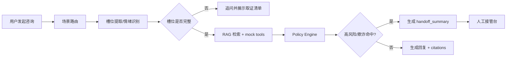
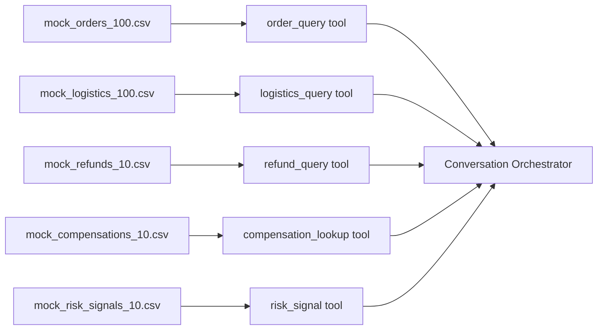
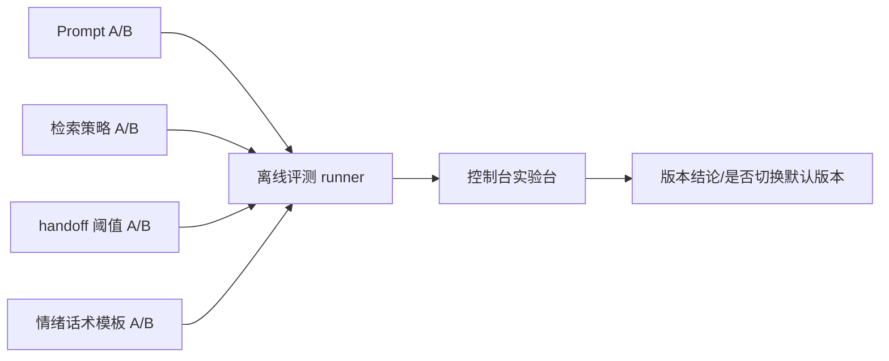

# Mock 流程图

## 1. 会话与取证一体页主流程

```mermaid
flowchart LR
  A["用户发起咨询"] --> B["场景路由"]
  B --> C["槽位提取/情绪识别"]
  C --> D{"槽位是否完整"}
  D -->|"否"| E["追问并展示取证清单"]
  D -->|"是"| F["RAG 检索 + mock tools"]
  F --> G["Policy Engine"]
  G --> H{"高风险/欺诈命中?"}
  H -->|"是"| I["生成 handoff_summary"]
  I --> J["人工接管台"]
  H -->|"否"| K["生成回复 + citations"]
```

## 2. mock 订单与物流联动

```mermaid
flowchart LR
  O["mock_orders_100.csv"] --> T["order_query tool"]
  L["mock_logistics_100.csv"] --> U["logistics_query tool"]
  R["mock_refunds_10.csv"] --> V["refund_query tool"]
  C["mock_compensations_10.csv"] --> W["compensation_lookup tool"]
  S["mock_risk_signals_10.csv"] --> X["risk_signal tool"]
  T --> Y["Conversation Orchestrator"]
  U --> Y
  V --> Y
  W --> Y
  X --> Y
```

## 3. A/B Test 版本验证闭环

```mermaid
flowchart LR
  P["Prompt A/B"] --> M["离线评测 runner"]
  Q["检索策略 A/B"] --> M
  R["handoff 阈值 A/B"] --> M
  S["情绪话术模板 A/B"] --> M
  M --> N["控制台实验台"]
  N --> Z["版本结论/是否切换默认版本"]
```
